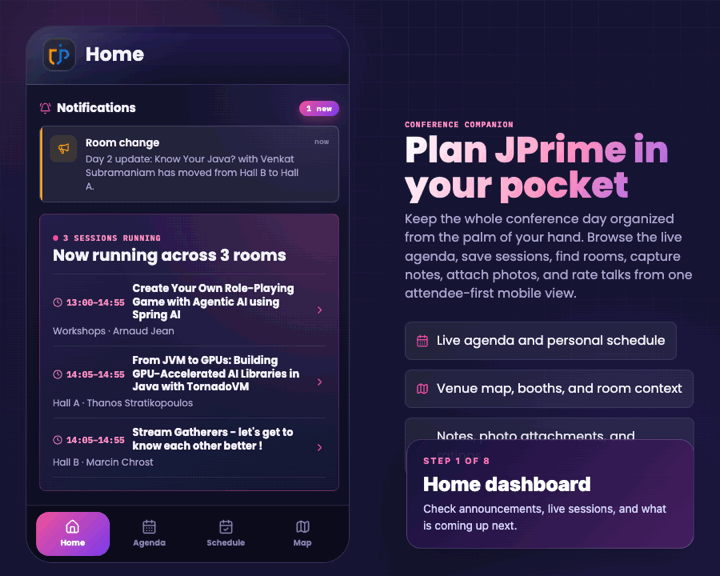

# JPrime Companion

JPrime Companion is a local conference companion app for JPrime, a Java and JVM ecosystem conference. It includes a React frontend, a Spring Boot REST API, and a PostgreSQL database seeded with conference data. The app can show sessions, speakers, notifications, maps, and per-device notes, ratings, and saved sessions.

## Walkthrough



## Requirements

- Node.js 20.19+ or 22.12+ with npm for the host-based scripts.
- Docker with Docker Compose for PostgreSQL and the containerized stack.
- JDK 25 for the host-based Spring Boot backend. Install it normally for your OS; Gradle uses its Java toolchain support to find it from `JAVA_HOME` or standard local installations. The containerized stack builds and runs the backend inside Docker instead.
- Optional: [Graphify CLI](https://github.com/safishamsi/graphify), only if you want to refresh or query the project knowledge graph locally.

## Start

Install the frontend dependencies once:

```sh
npm install --prefix frontend
```

Then start the full local stack:

```sh
npm start
```

This starts PostgreSQL, waits for it to become healthy, then starts the API on `http://localhost:8080` and the Vite app on `http://127.0.0.1:5173`. Stop everything with `Ctrl+C`.

Alternatively, run the backend and frontend inside containers:

```sh
npm run start:containers
```

This builds the Spring Boot API image, builds the React app as static assets served by Nginx, starts PostgreSQL on the compose network, and exposes the app at `http://localhost:5173` with the API at `http://localhost:8080`. You can also run the same stack directly with `docker compose up --build`. Stop it with `Ctrl+C`, or remove the containers and network with:

```sh
npm run containers:down
```

## Project Graph

The repo includes a generated Graphify knowledge graph snapshot in `graphify-out/`. It is there to help contributors and AI agents understand how the frontend, backend, data model, and tests connect without having to rediscover the whole codebase from scratch.

You do not need Graphify to run the app. Install it only when you want to refresh the tracked snapshot after code changes or explore the graph locally:

```sh
graphify update .
```

## Fresh Start Note

On a fresh start, Docker creates the local PostgreSQL volume, and the backend applies its database migrations before serving the app. The first launch opens with the seeded conference data and no saved sessions, notes, or ratings for your browser/device. Later starts reuse the same database volume and browser device ID unless you remove them.
